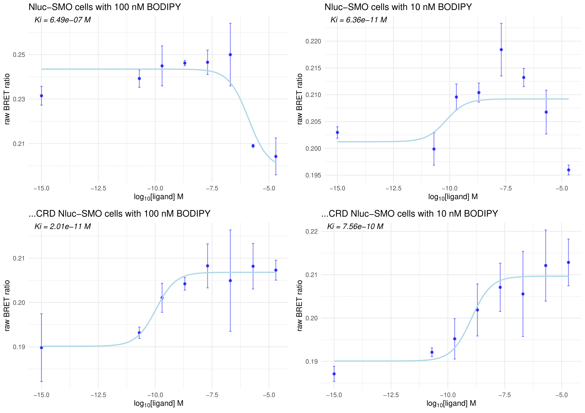

## Table of Contents
- [Introduction](#introduction)
- [Cheng-Prusoff equation](#cheng-prusoff-equation)
- [Results](#results)
- [References](#references)

---

## Introduction

This repository contains an R script designed to analyze BRET (Bioluminescence Resonance Energy Transfer) data from competition binding kinetics assays. The assay involves the use of BODIPY-cyclopamine, a fluorescently labeled ligand, in competition with an unlabeled (unknown) ligand for binding to Smoothened (SMO) receptors tagged with NanoLuciferase (Nluc). Two receptor variants were analyzed: full-length Nluc-SMO and ∆CRD Nluc-SMO (lacking the cysteine-rich domain). The primary objective of this analysis is to quantify the binding affinity of the unknown ligand by calculating its inhibition constant (Ki) using the Cheng-Prusoff equation, based on dose-response inhibition of BODIPY-cyclopamine binding.

---

## Cheng-Prusoff equation

The Cheng-Prusoff equation is used to convert IC50 values obtained from competition binding experiments into inhibition constants (Ki), which reflect the true binding affinity of the competing ligand.

```{bash}
R + L ⇌ RL       (1)   Kd = [R][L] / [RL]
R + I ⇌ RI       (2)   Ki = [R][I] / [RI]
```

Where:

- R - receptor (e.g., Nluc-SMO).
- L - labeled ligand (BODIPY-cyclopamine).
- I - inhibitor or competing unlabeled ligand.
- RL and RI - respective complexes.
- Kd - dissociation constant of the labeled ligand.
- Ki - inhibition constant of the unlabeled ligand.

In a competition assay, increasing concentrations of I displace L from R, reducing BRET signal. The concentration of I that reduces binding of L by 50% is the IC50. The Ki can be calculated from IC50 using the Cheng-Prusoff equation:

```{bash}
Ki = IC50 / (1 + [L]/Kd)
```

Where [L] is the concentration of the labeled ligand, and Kd is its known dissociation constant.

This equation assumes:

- The system is at equilibrium.
- Both ligands bind to the same site.
- The binding is reversible and competitive.

---

## Results




---

## References
1. Yung-Chi, C., & Prusoff, W. H. (1973). Relationship between the inhibition constant (KI) and the concentration of inhibitor which causes 50 per cent inhibition (I50) of an enzymatic reaction. Biochemical Pharmacology, 22(23), 3099–3108. https://doi.org/10.1016/0006-2952(73)90196-2
2. Kozielewicz, P., Bowin, C., Turku, A., & Schulte, G. (2019). A NanoBRET-Based binding assay for Smoothened allows real-time analysis of ligand binding and distinction of two binding sites for BODIPY-cyclopamine. Molecular Pharmacology, 97(1), 23–34. https://doi.org/10.1124/mol.119.118158
